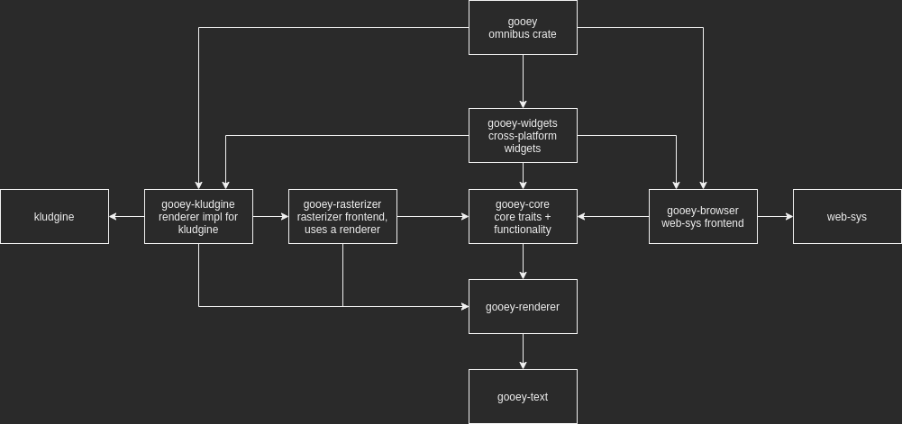

# gooey

**Warning:** This crate is incredibly early in development.

This is an attempt to write a cross-platform framework for creating user interfaces in Rust.

It is born from the ashes of the former UI system in [Kludgine](https://github.com/khonsulabs/kludgine). It aims to provide a framework that makes it easy to create descriptive and reative interfaces.

At the core of the architecture is the principle that `gooey` can't ever hope to cover every possible widget/control that every platform has access to, but it expects that you could add support for that widget without needing to submit PRs to this repository.

That being said, the main crate aims to provide two frontends:

* WASM-based virtual dom: The ability to convert gooey interfaces into an interactive browser application. The vdom implementation hasn't been decided upon yet.
* Kludgine theme-able rendering: The ability to run efficiently and natively using wgpu on a variety of platforms.

## gooey-core

The core crate will consist of platform-agnostic code including:

* `Widget` trait: Each user interface element must implement this trait.
* Layout logic: Basic layout strategies including grid and absolute layout.
* `Materializer` trait: To render a `Widget`, a `Materializer` must exist for the `Frontend` being used.
* Widgets: The core widgets that are built-in. At this level, the cross-platform definitions and functionality are provided.

## gooey-`frontend`

These crates define the API that users creating applications will use to initialize and run their user interfaecs. These crates will also define any traits needed to implement `Materializer`s for the front end in question.

This crate will also implement all widgets defined by gooey-core.

## gooey

The omnibus crate wraps all of the crates into a single consumable crate.

